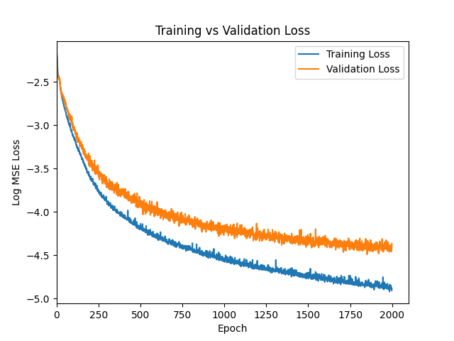

# Latent Polynomial Transformer

Training a small transformer to learn latent multivariable polynomials.



## How It Works

First a multivariable cross term polynomial is procedurally generated to have range (-1, 1) on domain (-1, 1).

A given input/output pair may look like
``` { x1: 0.5926, x2: -0.158062, x3: -0.48829, x4: 0.8990743 } -> 0.30462 ```.

Those inputs are preprocessed into a one hot encoded token sequence of the form
``` 5926,-158062,-48829,8990743 ```.

The model then learns to approximate the output of the hidden polynomial given the tokenized input.

## Why This Task?

Learning a hidden polynomial function of text based input data is a structurally similar problem to that of reranking in a multistage retrieval model.

This toy example shows how a transformer can learn and functionally compose over numerical quantities derived from text. This mimics how we believe reranking models might learn low level quantitative features of documents and queries and compose these into high level relevance metrics like TF, IDF, and BM25.
